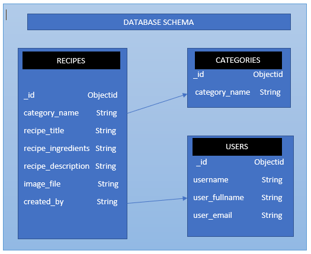
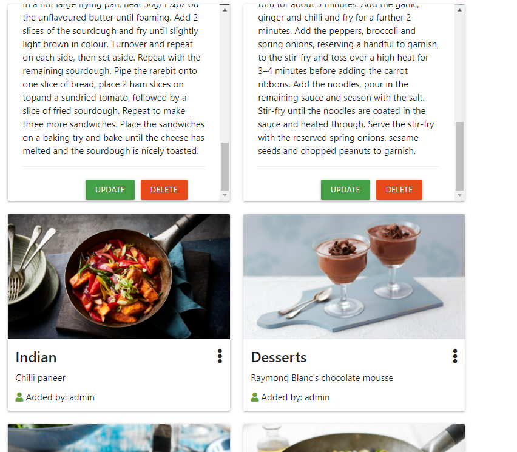
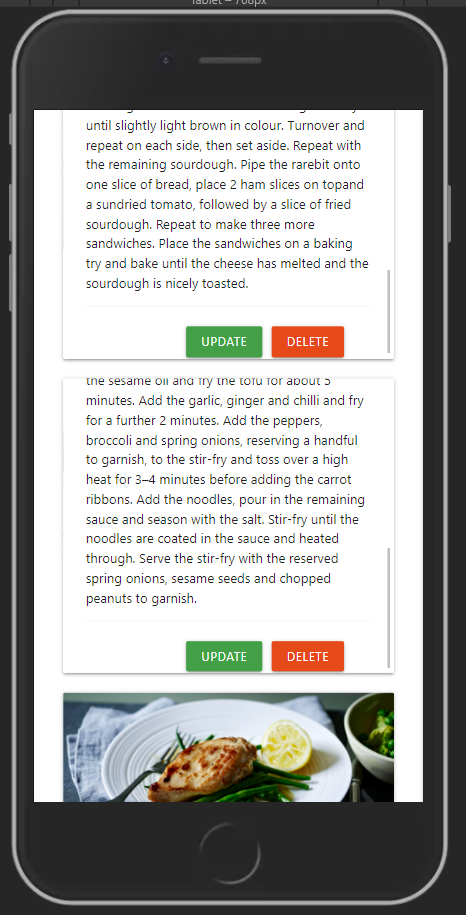
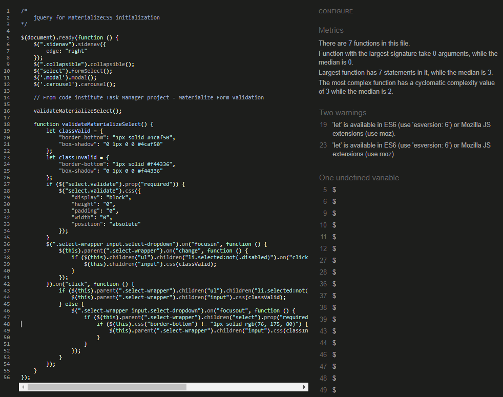
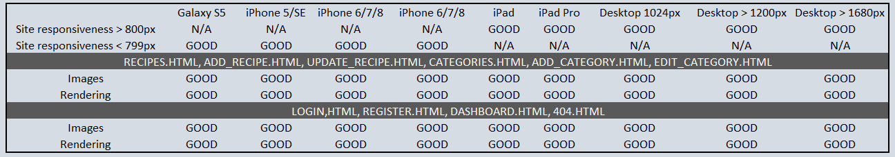
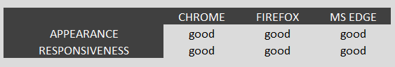

# PROJECT NAME - SELSEY KITCHEN

This is the third Milestone Project undertaken as part of the course for the Full stack developer certification from Code Institute. The purpose is to build a build a full-stack site that allows users to manage a common dataset about a particular domain.

<a href="http://rk-selsey-kitchen.herokuapp.com/" target="_blank">Deployed project domain</a>

### UX - 
Selsey Kitchen is a recipe website for people interested in sharing recipes and getting inspired to try new recipes. It allows the user to add, delete and update a set of recipes and has a useful search option. The website also shared relevant news and blogs from other cooking websites in addition to promoting a range of premium kitchen knives for users and visitors. The site is designed for the administrator to be an active particiant/user and have full access to all recipes posted. The admin can also add, edit or delete the various recipe categories.

### USER STORIES

##### A. VISITORS

1. As a visitor, I want to be able to view the site on desktop, mobile and tablet.

2. As a visitor, I want the website to be simple and with easy navigation.

3. As a visitor, I want to see a list of all recipes on offer before I decide to register. 

4. As a visitor, I want to be able to search for recipes that are relevant to me.

5. As a visitor, I want to register an account, so I can share my recipes.

##### B. MEMBERS

1. As a member, I want to login and logout of my account.

2. As a member, I want to add and share recipes.

3. As a member, I want to be able to add a recipe without having an image to upload initially.

4. As member, I want to be able to update or delete my recipes.

##### C. ADMIN

1. As admin, I want to be able to be able to perform all tasks that are available to members.

2. As admin, I want to be able to have access to update or delete any member recipes.

3. As admin, I want to be able to add, edit or delete recipe categories.

### WIREFRAMES -

1. <a href="https://github.com/RoVsEk23/selsey_kitchen/blob/master/wireframes/desktop_wireframes.pdf" target="_blank">Desktop wireframe (Github link)</a>
2. <a href="https://github.com/RoVsEk23/selsey_kitchen/blob/master/wireframes/mobile_wireframes.pdf" target="_blank">Mobile wireframe (Github link)</a>

### TECHNOLOGY -

`Languages used -` 
HTML5, CSS3, jQuery, Python

`Frameworks, Libraries, Etc. -`
Gitpod, GIT, GitHub, Materialize, MongoDB, Flask, Jinja, Heroku, Werkzeug, AWS SDK - Boto3, AWS S3, Mockplus

`Testing -`
Chrome DevTools, W3C Markup Validator, W3C CSS Validator, PEP8, JShint

### DATABASE ARCHITECTURE - 

The project comprises of three collections in MongoDB as shown below.

 

### LAYOUT -

#### 1. DESKTOP

##### LANDING PAGE

   

##### DASHBOARD, ADD RECIPES, UPDATE RECIPES

  

##### MANAGE CATEGORIES, DELETE CONFIRMATION

  

#### 2. MOBILE

##### LANDING PAGE

     

##### DASHBOARD, ADD RECIPES, UPDATE RECIPES

   

##### MANAGE CATEGORIES, DELETE CONFIRMATION, LOG IN

   

### DESIGN -

##### GENERAL FEATURES - 

1. I have tried to making the navigation simple and consistent throughtout the site.

2. I have tried to make the pages visually appealing.

3. Flash messages for every action that the user or admin does. Defensive programming by modal on delete actions.

4. Defensive programming approach used for validating username, password and input fields on add and update recipes. 

4. The header provides easy navigation to various pages and also the drop down menu for mobile.

5. The footer has links to social media and my personal Github page.

##### PAGES - 

1. Header and footer remains the same throughout the site.

2. The landing page displays relevant articles followed by search and recipe cards. This is followed by a carousel display of products that the site owner wants to promote. The admin has been provided privilege to update or delete any recipe directly from the homepage. This feature is not provided to general users or visitors.

3. The register and log in pages has been kept simple and redirects to the user dashboard on creation or logging in.

4. The user dashboard is a collapsible popout of the various recipes that the user has uploaded. There are update and delete options on every recipe.

5. The add and update recipe forms are almost identical. The user has the option of not uploading an image to the recipe on the first time entry. A placeholder image will be used initially. But the user must upload an image if the intend to update the recipe. This functionality helps the user to update a recipe quickly even if they dont have an image handy to upload. But to maintain full access to the recipe they must upload an image.

6. The admin has a manage categories page available where categories can be added, edited, or deleted.

##### BUGS - 

1. Initially the modal was deleting the incorrect record. I was able to pass the modal the correct recipe id to fix this bug.

2. I was initially unable to configure the connection between MongoDB and AWS S3 despite following the documentation provided. I was only able to get the placeholder image to load to the site but not the uploaded image. I was then able to use some information on stack overflow to help define the path correctly.

3. A bug was found in the update_recipe function which was preventing the user from updating the file without uploading a new image as the image would revert to the placeholder image when an update was performed without adding a new image. I was advised by tutor support to use the $Set method to fix this issue. But i have used an alternate method which is an easy fix (maybe not ideal) to sort the issue. I have added a conditon that checks for the first 4 charaters "http" to select the file path.  

##### KNOWN ISSUES - 

1. Currently,  only uploaded image sizing of 1600 X 900 works best for cards to stay alligned. The placeholder image is also set to this dimension. I think I need to use some python functionality like PIL import Image and set import image resizing criteria for the images to be uploaded without breaking the grid. I have not been able to implement this because of the submission deadline.

##### FEATURES TO ADD IN FUTURE - 

1. Pagination for recipes on home page and dashboard.

2. Recipe to open in a seperate page from the card layout.

3. Ability for User to delete their profile.

4. User profile form added to dashboard with relevant user information.

5. I have not paid too much attention to the cosmetic side of the site. I have focussed more on the functionality. Some cosmetic enhancements need to me made later.

### TESTING -

#### 1. CODE VALIDATION

A. HTML VALIDATION

1. Parsing errors on all pages built with jinja templating.

B. CSS VALIDATION

 

B. Jshint VALIDATION

 

C. PEP8

 

#### 2. RESPONSIVE - 

The website was tested with Chrome DevTools and Responsive Design Checker on a variety of devices ranging from desktop, tablet, small, medium and large screen mobile devices.

Desktop: 1024px, 1366px, 1440px, 1600px and 1680px.

Mobile & Tablet: Galaxy S5, iPhone 5/SE, iPhone 6/7/8, iPhone 6/7/8 plus, iPhone x, iPad and iPad Pro

 

A. GOOGLE MOBILE TEST

 

#### 3. BROWSER

The site was tested on Google Chrome, Firefox and Microsoft Edge. Cross browser invalid links will show a 404 error.

 

### MANUAL TESTING - 

#### 1. HEADER - All links on header and the mobile navbar work as expected. The logo redirects to the homepage. 

#### 2. FOOTER - Social media links and Github link open in a new tab.

#### 3. HOMEPAGE - Visitor and member view of homepage displays exactly the same. Links to article cards open in a new window. Search functionaly returns results as expected. The card display of recipes responds as intended. Update and Delete buttons available on each recipe when accessed by admin.

#### 4. DASHBOARD - The simple collapsible popout list for recipes persofrms as intended for admin and members. Update and Delete buttons redirect to relavant actions. Modal functionality for delete button works.

#### 5. NEW RECIPE - Add recipe page form loads accrately. Input fields are validated.

#### 6. MANAGE CATEGORIES - Manage categories page for admin loads simple cards with edit and delete buttons. Add and Edit form loads accurately. Modal functionality for delete button works.

#### 7. LOG IN and REGISTER PAGE - All links work accurately.

All Flash messages are displayed accurately.

### TESTING USER STORIES

##### A. VISITORS

1. As a visitor, I want to be able to view the site on desktop, mobile and tablet.

Acceptance: Visitors can view the site on desktop, tablet or phone.

2. As a visitor, I want the website to be simple and with easy navigation.

Acceptance: Visitors can navigate through the site using the navbar on the header. For the mobile visitors there is a dropdown hamburger menu. 

3. As a visitor, I want to see a list of all recipes on offer before I decide to register. 

Acceptance: Visitors can view cards of all recipes on the site and have the same homepage view as all users.

4. As a visitor, I want to be able to search for recipes that are relevant to me.

Acceptance: There is search functionality on the top of the recipe cards that allow the visitor the ability to search from the ingredients and desciption of all recipes.

5. As a visitor, I want to register an account, so I can share my recipes.

Acceptance: The visitor can use the register button the header to redirect to the registration page. Visitors who have already registered can link to the login page from the register page.

##### B. MEMBERS

1. As a member, I want to login and logout of my account.

Acceptance: Members can access login and logout from the header or from the dropdown nav on mobile.  

1. As a member, I want to add and share recipes.

Acceptance: After logging in members can click on 'New recipe' in the header or the dropdown on mobile to redirect to the add new recipe page.

2. As a member, I want to be able to add a recipe without having an image to upload initially.

Acceptance: A member can add a new recie without having an image to upload. A placeholder image will be used. 

3. As member, I want to be able to update or delete my recipes.

Acceptance: Member have a dashboard with a collapsible menu that lists all their recipes. They can update or delete their recipes from this page. The update recipe button will redirect the user to the update recipe form. The delete button deletes the members unwanted recipes.

##### C. ADMIN

1. As admin, I want to be able to be able to perform all tasks that are available to members.

Acceptance: The site is designed for the admin to be an active participant in all ways that a member is. The admin can add, update and delete recipes from the dashboard.

2. As admin, I want to be able to have access to update or delete any member recipes.

Acceptance: The admin has access to update or delete recipes throughout the site directly from the homepage. Every recipe card has edit and delete buttons that are accessible only to the admin.

3. As admin, I want to be able to add, edit or delete recipe categories.

Acceptance: The admin can add, edit or delete categories from the manage categories page.

### DEPLOYMENT - 

Requirements - 

1. Python3
2. Gitpod
3. MongoDB 
4. Heroku 
5. Github
6. AWS SDK - Boto3
7. AWS S3

Clone the project - 

Make a local clone using the following steps.

1. Create a Github account, log in go to the repository.

2. Click on the button named “Code” for the dropdown menu.

3. Click on “Open with GitHub Desktop” and follow instructions in the GitHub Desktop Application. Alternatively you can follow the instructions from this **[link] (https://docs.github.com/en/github/creating-cloning-and-archiving-repositories/cloning-a-repository-from-github/cloning-a-repository#cloning-a-repository-to-github-desktop)** to find other ways to clone a repository.

4. Next steps

A. Install requirements: From the workspace of your local copy type: pip3 install -r requirements.txt in the IDE terminal. 

B. Create a database in MongoDB  

    - Signup and login to your MongoDB account.
    - Create a cluster and a database.
    - Create three collections in the db: **categories, recipes and users.**
    - Add string values for the collections. 

C. Create an S3 bucket on AWS

    - Signup and login to your AWS account.
    - Create an Amazon S3 bucket as a storage location to hold image files.
    - Choose region closest to your geographic location
    - You can leave all settings as default
    - Choose Create bucket  
    - You can refer to the following **[documentation] (https://boto3.amazonaws.com/v1/documentation/api/latest/reference/services/s3.html)** to help setup your AWS S3 services.

D. Create the environment variables 

    - Create a .gitignore file in the root directory of the project.
    - Add the env.py file to .gitignore.
    - Create env.py to contain all the envornment variables.
        
    import os
    os.environ["IP"] = "To be added"
    os.environ["PORT"] = "To be added"
    os.environ["SECRET_KEY"] = "To be added"
    os.environ["MONGO_URI"] = "To be added"
    os.environ["MONGO_DBNAME"] = "To be added"
    os.environ["S3_BUCKET_NAME"] = "To be added"
    os.environ["S3_KEY"] = "To be added"
    os.environ["S3_SECRET"] = "To be added"
    os.environ["S3_LOCATION"] = "To be added"

4. Run the app: From the terminal of your IDE. Type python3 app.py to run the app.

DEPLOYMENT IN HEROKU

1. Set up your local workspace for Heroku 

    - In the terminal window of your IDE type: **pip3 freeze -- local > requirements.txt.** (So Heroku can read the file to be installed.)
    - In termial window of your IDE type: **python app.py > Procfile** (So Heroku can read the file to be used on entry)

2. Set up Heroku 
    Create a Heroku account, create a new app and select region. 

3. Deployment method 'Github'

    - Click on the **Connect to GitHub** section in the deploy tab in Heroku. 
    - Identify your repository to **connect** your reposiry to Heroku.
    - Go to **Config Vars** in the settings app in Heroku. Click on **Reveal Config Vars**.
    - Enter the data contained in your env.py file.     

        **["IP"] ["PORT"] ["SECRET_KEY"] ["MONGO_URI"] ["MONGO_DBNAME"] ["S3_BUCKET_NAME"] ["S3_KEY"] ["S3_SECRET"] ["S3_LOCATION"]** 

4. Push the requirements.txt and Procfile to repository from the terminal. 

        $ git add requirements.txt
        $ git commit -m "Add requirements.txt"
        $ git add Procfile 
        $ git commit -m "Add Procfile"

5. Deployment: Go to the deploy tab in Heroku and scroll down to **Automatic deployments**. Click on **Enable Automatic Deploys**. 

Heroku will connect to Github and host the app. 

Click on **Open app** in the right corner of your Heroku account. The app wil open and the live link is available from the address bar. 

http://rk-selsey-kitchen.herokuapp.com/

### CREDITS -

#### A. EXTERNAL RESOURCES

CODE:

<a href="https://www.w3schools.com/" target="_blank">W3schools</a> and <a href="https://stackoverflow.com/" target="_blank">Stackoverflow</a> for help with bugs and code

<a href="https://fontawesome.com/" target="_blank">Fontawesome</a> for icons

<a href="https://randomkeygen.com/" target="_blank">Random Key Generator</a> for passwords

<a href="https://boto3.amazonaws.com/v1/documentation/api/latest/guide/s3.html" target="_blank">Boto3 Documentation</a> for image upload 

<a href="https://stackabuse.com/file-management-with-aws-s3-python-and-flask/" target="_blank">AWS S3 Configuration</a> for image upload config

<a href="https://www.youtube.com/watch?v=mBKKZN1MMBM" target="_blank">404 error handler</a> tutorial

MEDIA:

<a href="https://www.mockplus.com/" target="_blank">Mockplus</a> for wireframes

<a href="https://www.epicurious.com/" target="_blank">Epicurious</a> for articles

<a href="http://ami.responsivedesign.is/" target="_blank">http://ami.responsivedesign.is/</a> image for readme banner

<a href="https://designshack.net/articles/software/placeholder-image/" target="_blank">Placeholder</a> image 

<a href="https://www.kitchenknives.co.uk/" target="_blank">Products</a> in knives corousel 

RECIPES:

<a href="https://www.bbc.co.uk/food" target="_blank">BBC Food Guide</a> for all recipes and recipe images

#### B.  INTERNAL RESOURCES

Code Institute- Task Manager mini project for a lot of the site functionality

Code Institute mentor and tutor support

