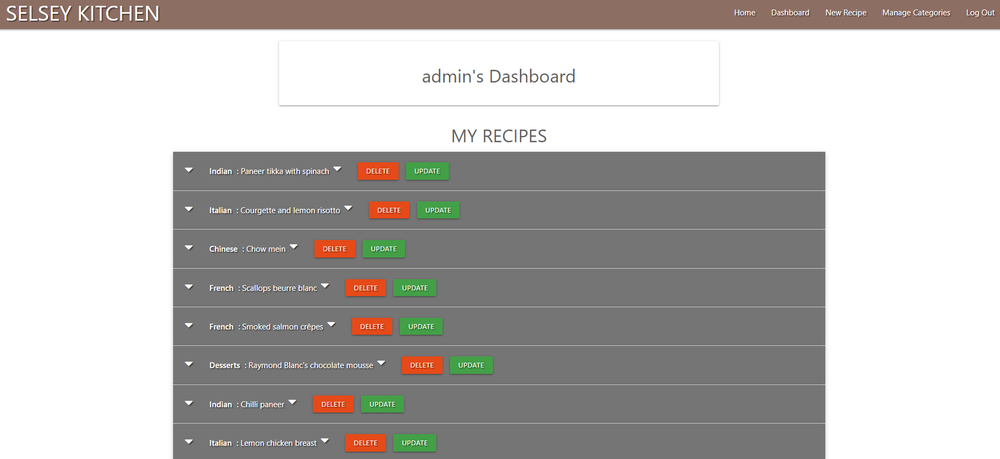

# PROJECT NAME - SELSEY KITCHEN

This is the third Milestone Project undertaken as part of the course for the Full stack developer certification from Code Institute. The purpose is to build a build a full-stack site that allows users to manage a common dataset about a particular domain.

<a href="http://rk-selsey-kitchen.herokuapp.com/" target="_blank">Deployed project domain</a>

### UX - 
Selsey Kitchen is a recipe website for people interested in sharing recipes and getting inspired to try new recipes. It allows the user to add, delete and update a set of recipes and has a useful search option. The website also shared relevant news and blogs from other cooking websites in addition to promoting a range of premium kitchen knives for users and visitors. The site is designed for the administrator to be an active particiant/user and have full access to all recipes posted. The admin can also add, edit or delete the various recipe categories.

### WIREFRAMES -

1. <a href="https://github.com/RoVsEk23/selsey_kitchen/blob/master/wireframes/desktop_wireframes.pdf" target="_blank">Desktop wireframe (Github link)</a>
2. <a href="https://github.com/RoVsEk23/selsey_kitchen/blob/master/wireframes/mobile_wireframes.pdf" target="_blank">Mobile wireframe (Github link)</a>

### TECHNOLOGY -

`Languages used -` 
HTML5, CSS3, jQuery, Python

`Frameworks, Libraries, Etc. -`
Gitpod, GIT, GitHub, Materialize, MongoDB, Flask, Jinja, Heroku, Werkzeug, AWS SDK - Boto3, AWS S3, Mockplus

`Testing -`
Chrome DevTools, W3C Markup Validator, W3C CSS Validator, PEP8, JShint

### LAYOUT -

#### 1. DESKTOP

##### LANDING PAGE

  

##### DASHBOARD, ADD RECIPES, UPDATE RECIPES

  

##### MANAGE CATEGORIES, DELETE CONFIRMATION

  

#### 2. MOBILE

##### LANDING PAGE

    

##### DASHBOARD, ADD RECIPES, UPDATE RECIPES

   

##### MANAGE CATEGORIES, DELETE CONFIRMATION, LOG IN

   

### DESIGN -

##### GENERAL FEATURES - 

1. I have tried to making the navigation simple and consistent throughtout the site.

2. I have tried to make the pages visually appealing.

3. Flash messages for every action that the user or admin does. Defensive programming by modal on delete actions.

4. The header provides easy navigation to various pages and also the drop down menu for mobile.

5. The footer has links to social media and my personal Github page.

##### PAGES - 

1. Header and footer remains the same throughout the site.

2. The landing page displays relevant articles followed by search and recipe cards. This is followed by a carousel display of products that the site owner wants to promote. The admin has been provided privilege to update or delete any recipe directly from the homepage. This feature is not provided to general users or visitors.

3. The register and log in pages has been kept simple and redirects to the user dashboard on creation or logging in.

4. The user dashboard is a collapsible popout of the various recipes that the user has uploaded. There are update and delete options on every recipe.

5. The add and update recipe forms are almost identical. The user has the option of not uploading an image to the recipe on the first time entry. A placeholder image will be used initially. But the user must upload an image if the intend to update the recipe. This functionality helps the user to update a recipe quickly even if they dont have an image handy to upload. But to maintain full access to the recipe they must upload an image.

6. The admin has a manage categories page available where categories can be added, edited, or deleted.

##### FEATURES TO ADD IN FUTURE - 

1. Pagination for recipes on home page and dashboard.

2. Recipe to open in a seperate page from the card layout.

3. Ability for User to delete their profile.

4. User profile form added to dashboard with relevant user information.

### USER STORIES

##### A. VISITORS

1. As a visitor, I want to be able to view the site on desktop, mobile and tablet.

Acceptance: Visitors can view the site on desktop, tablet or phone.

2. As a visitor, I want the website to be simple and with easy navigation.

Acceptance: Visitors can navigate through the site using the navbar on the header. For the mobile visitors there is a dropdown hamburger menu. 

3. As a visitor, I want to see a list of all recipes on offer before I decide to register. 

Acceptance: Visitors can view cards of all recipes on the site and have the same homepage view as all users.

4. As a visitor, I want to be able to search for recipes that are relevant to me.

Acceptance: There is search functionality on the top of the recipe cards that allow the visitor the ability to search from the ingredients and desciption of all recipes.

5. As a visitor, I want to register an account, so I can share my recipes.

Acceptance: The visitor can use the register button the header to redirect to the registration page. Visitors who have already registered can link to the login page from the register page.

##### B. MEMBERS

1. As a member, I want to login and logout of my account.

Acceptance: Members can access login and logout from the header or from the dropdown nav on mobile.  

1. As a member, I want to add and share recipes.

Acceptance: After logging in members can click on 'New recipe' in the header or the dropdown on mobile to redirect to the add new recipe page.

2. As a member, I want to be able to add a recipe without having an image to upload initially.

Acceptance: A member can add a new recie without having an image to upload. A placeholder image will be used. But they must upload image when they want to update the recipe.

3. As member, I want to be able to update or delete my recipes.

Acceptance: Member have a dashboard with a collapsible menu that lists all their recipes. They can update or delete their recipes from this page. The update recipe button will redirect the user to the update recipe form. The delete button deletes the members unwanted recipes.

##### C. ADMIN

1. As admin, I want to be able to be able to perform all tasks that are available to members.

Acceptance: The site is designed for the admin to be an active participant in all ways that a member is. The admin can add, update and delete recipes from the dashboard.

2. As admin, I want to be able to have access to update or delete any member recipes.

Acceptance: The admin has access to update or delete recipes throughout the site directly from the homepage. Every recipe card has edit and delete buttons that are accessible only to the admin.

3. As admin, I want to be able to add, edit or delete recipe categories.

Acceptance: The admin can add, edit or delete categories from the manage categories page.

### TESTING -

#### 1. CODE VALIDATION

A. HTML VALIDATION

1. Parsing errors on all pages built with jinja templating.

B. CSS VALIDATION

 

C. PEP8

 

#### 2. RESPONSIVE - 

The website was viewed on a variety of devices such ranging from desktop, tablet, small, medium and large screen mobile devices.

A. GOOGLE MOBILE TEST

 

#### 3. BROWSER

The site was tested on Google Chrome, Firefox and Microsoft Edge. Cross browser invalid links will show a 404 error.

### DEPLOYMENT - 

Requirements - 

1. Python3
2. Gitpod
3. MongoDB 
4. Heroku 
5. Github
6. AWS SDK - Boto3
7. AWS S3

Steps - 

1. Install requirements: pip3 install -r requirements.txt.

2. Create cluster and database in MongoDB

3. Create the collections in the db: categories, recipes, users.

4. Create AWS account and bucket to upload images.

5. Create env.py

6. Create .gitignore

7. Add env.py file in .gitignore.

8. Env.py code  

import os

os.environ["IP"] = "enter"

os.environ["PORT"] = "enter"

os.environ["SECRET_KEY"] = "enter"

os.environ["MONGO_URI"] = "enter"
    
os.environ["MONGO_DBNAME"] = "enter"

os.environ["S3_BUCKET_NAME"] = "enter"

os.environ["S3_KEY"] = "enter"

os.environ["S3_SECRET"] = "enter"

os.environ["S3_LOCATION"] = "enter"

RUN: Type python3 app.py from the terminal window to run the app.

DEPLOYMENT IN HEROKU

1. Set up Heroku account with deployment method  as Github.

2. Set up local workspace for Heroku

3. Gitpod/IDE command: pip3 freeze -- local > requirements.txt and : python app.py > Procfile 

4. Connect to GitHub section in the deploy tab in Heroku

5. Search your repository to connect to Heroku

6. Set up Config Vars in Heroku

7. Enter env.py variables 

8. Push the requirements.txt and Procfile to Github

9. Set up automatic deployment in Heroku. Enable Automatic Deploys. Deploy Branch

10. Heroku will receive the code from Github and host the app 

http://rk-selsey-kitchen.herokuapp.com/

### CREDITS -

